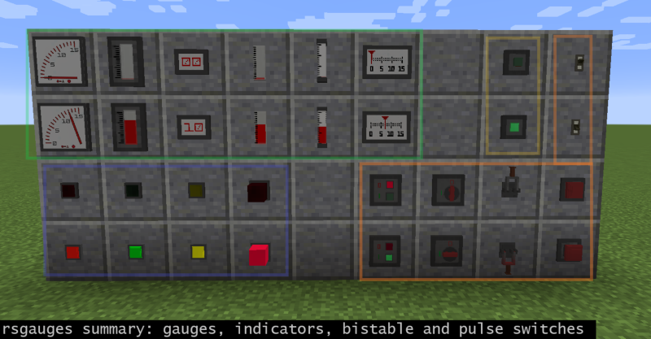
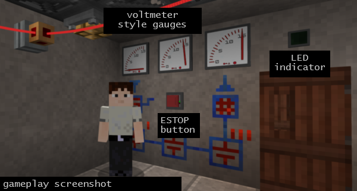

# Redstone Gauges and Switches (`rsgauges`)

`rsgaues` is a small [Minecraft](https://minecraft.net) (Java Edition) mod based on
[`Forge`](http://www.minecraftforge.net/). The Mod adds devices to measure or "produce"
redstone power to the game:

  - Gauges are small devices, which can be attached to any solid block in the game, and
    they measure the redstone power that this blocks receives from blocks around it.
    Their displays are analog or digital and quantised from 0 to 15. The measurement method
    differs a bit from how e.g. comparators or redstone lamps react, see the details below.

  - Indicators are on-off displays attached to blocks, measuring like gauges (and are
    basically gauges). They are "off" if the power is zero, and "on" if the power is
    greater than zero. It depends on the indicator how the display looks like, some
    are simple LED like lights, some are blinking, some play a sound (e.g. the alarm
    siren) etc.

  - Bistable switches are basically vanilla Minecraft levers with a different style.
    They produce redstone power in the block they are attached to and are
    manually switched on and off. There are currently no special features different
    from levers implemented.

  - Pulse switches are like vanilla Minecraft buttons with a different style. They also
    produce redstone power in the block they are attached to, and they switch
    off automatically after a short time. However, pulse switches can be pushed multiple
    times, extending the delay (each right-click) before switching off again.

  - Contact switches are switches that are activated when somone/something collides with
    them. E.g. contact mats (like pressure plates) are in this category.

  - Automatic switches are sensor based switches like motions sensors, laser sensors,
    and environmental sensors.

#### Summary screenshot

  

#### Testing gameplay screenshot

  Testing game with 85 other mods installed, mainly to check compatibility and recipe
  collisions (and it's also simply fun). The screenshot shows the front end of a (electrical)
  Diesel generator control. Walls and the red wiring is from [Blusunrize's Immersive Engineering](https://github.com/BluSunrize/ImmersiveEngineering/),
  the door from [Nihiltres Engineer's Doors](https://minecraft.curseforge.com/projects/engineers-doors/),
  wall drawings from [Chisels and bits by AlgorithmX2](https://github.com/AlgorithmX2/Chisels-and-Bits),
  gauges, the ESTOP button and the indicator above the door from this mod. The voltmeter
  style gauges are used to show the state of charge of buffering capacitors (IE), the ESTOP
  is to force the Diesel control off (actually an assembly language programmed [Minecoprocessor by ToroCraft](https://minecraft.curseforge.com/projects/minecoprocessors/)). The LED is used to show if the
  Diesel generator is currently running or not.

  

## Recipes

  - The first gauge is crafted 9x9 by putting redstone dust at the bottom and a comparator in the center,
    filling up the rest with iron nuggets. All other gauges are derived from this, simply put the first
    gauge into the crafting area to get the second and so on. At the implemented last gauge it
    rotates back to the first.

  - The first indicator is crafted like the first gauge, except that glowstone dust is in the
    centre. Then "rotate craft" the one that suits the style where you want to place it.

  - The first sound indicator has a note block in the centre.

  - The first bistable switch - surprise - has a lever in the centre, further style selections
    same as above.

  - The first pulse switch has a stone or wood button in the centre, then cycle through as above.

  - The first floor contact switch has a note block in the centre, then cycle through as above.

  - The first contactless sensor switch (higher range, automatic) has an ender eye in the center.

  - The first one-block range detectors have a tripwire hook in the center.

  - Redstone power sensitive glass is produced with glass blocks north,south,east,west, redstone
    dust in the centre, and iron nuggets in the corners.

## Mod pack integration, forking, back ports, bug reports

  - Packs: If your mod pack is open source as well and has no installer, you don't need to ask
    and simply integrate this mod.

  - Forking: It's MIT, you can fork the code under the same conditions.

  - Back ports: I've just started modding and like to stick with MC versions >=1.12.2. Sorry,
    no back ports.

  - Bug reports: Yes, please let me know. Drop a mail or better open an issue for the repository.

## Revision history

  - v1.0.3b6  - Inverted redstone sensitive glass added (light emitting).
              - Touch configurable glass contact plate added.
              - Glass infrared motion detector added.
              - Glass linear laser detector added.
              - Glass daytime switch added.
              - Glass interval timer switch added.
              - Enabled glass switch color teaching (dye-left-click-tinting).
              - Language files updated (Chinese prepared, still contains English words).

  - v1.0.3b5  - Fixed server startup crash issue due to color handler event subscription,
                which is unfortunately client side only. Thanks to Dave for posting this
                on github (issue #6).
              - Chinese language file added (thanks to sfchipan for the pull request
                on github)
              - German language file added, too.

  - v1.0.3b4  - Glass bi-stable, pulse, and contact switches added.
              - Sensitive glass textures edited.
              - backend: Configuration based block/item block initialisation improved.
              - backend: Unified switch color tinting support implemented.
              - backend: Unified switch light emission support implemented.

  - v1.0.3b3  - Stained redstone sensitive glass blocks added, changing from
                clear to stained-colored, but do not emit light as the clear
                sensitive glass block.

  - v1.0.3b2  - Mod specific creative tab added.
              - Industrial bi-stable switch 1 model improved.
              - Rustic floor contact switch UI texture added.
              - Multi-left-click config (weak/inverted) now double-click
                for each step.
              - Added switch left-click option 'no output' (default disabled
                in mod options, feature for future use).

  - v1.0.3b1  - Industrial gauge models improved.
              - Rustic wall gauge added.
              - Exact pulse switch off-timing using redstone-dust-left-clicking added.

  - v1.0.2    - Release based on v1.0.2b2.

  - v1.0.2b2  - Added "rustic" switch series switches.

  - v1.0.2b1  - Added "old fancy" switch series.
              - Changed sensitive glass recipe.
              - Fixed automatic switch iterative recipe.
              - Fixed version update bug (switchtileentity.reset() recursion), thanks to @tenosko.
              - Added "rustic" switch series (partial).

  - v1.0.1    - Release based on v1.0.1b3.

  - v1.0.1b3  - Added local light sensor switch.
              - Added rain sensor switch.
              - Added lightning potential sensor switch.
              - Added (day) timer clock.
              - Added interval timer.
              - Prepared translation/localisation for text messages.
              - Changed multi-left-click config default timeout from 1200ms to 700ms.

  - v1.0.1b2  - Added bistable mechanical/retro style hopper blocker switch.
              - Added bistable mechanical/retro style rotary lever switch.
              - Added bistable mechanical/retro style lever switch.
              - Added pulse mechanical/retro style pull switch.
              - Added pulse mechanical/retro style push switch.
              - Added pulse mechanical/retro style double pole push switch.
              - Added power state dependent construction time bounding box definitions for switches.
              - Changed recipe order for light flip switch (to end of style selection list).
              - Changed ring-fenced-pulse-switch front texture.
              - Fixed localisation name of arrow target pulse switch.
              - Fixed texture bleeding, UV scaling, and bounding box of the alarm siren.

  - v1.0.1b1  - Added configurable infrared motion sensor (volume range automatic switch).
              - Added configurable sensor (linear range automatic switch).
              - Added configurable door contact mat.
              - Added sensitive floor contact mat.
              - Added fenced pulse switch.
              - Added arrow target pulse switch.
              - Added alarm siren (sound indicator).
              - Added redstone sensitive glass (color change black->white, light source).
              - Added feature to switches: Empty handed multi-leftclick cycles through
                (strong -> weak -> weak inverted -> strong inverted -> strong etc).
              - Door contact mat, infrared and laser sensor have a keypad to configure
                range/sensitivity, entity type (all, players, mobs, villagers, animals,
                objects, etc), entity count threshold, and output redstone power.
              - Machine pulse switch can be activated with projectiles (but not the fenced one).
              - ESTOP switch can be switched off with projectiles, but not on.
              - Sensitive contact mat reacts to hitting projectiles and objects dropped on.

  - v1.0.0    - Final recipe tuning (gauge and lamp indicator).

  - v1.0.0rc4 - Performance improvements, startup screen config options added.
              - Fix: Network client: Gauge display zero when hit or activated.

  - v1.0.0rc3 - Fix: Tile entity based gauge handling to prevent display glitches on network clients.

  - v1.0.0rc2 - Fix: Server based gauge processing to measure indirect weak power.

  - v1.0.0rc1 - Initial feature complete version.

## Functional details

#### Gauges and indicators

  - Gauges measure a bit differently as e.g. redstone lamps. The gauges do not only react
    to the (strong or weak) power they receive themselves, but also lookup the power that
    the adjacent block they face receives. This prevents the gauges from seeing indirect
    (weak) power from adjacent blocks, causing incorrect display values. The behaviour
    is:

    - If the gauge is attached to a block that can provide redstone power, such as a
      redstone block or a device of a mod that has a redstone output on the side, then
      the gauge will display the maximum of weak and strong power coming from the facing
      of that device. That is pretty much as most redstone inputs behave.

    - If the gauge is attached to a block that cannot produce redstone power, but can be
      powered (most blocks except glass, air, fluids, etc), then the gauge looks what power
      this block receives from all sides where blocks are that can provide redstone power.
      Also here: the maximum of weak and strong power is taken from each side, and then the
      total maximum of all sides is displayed. That means it behaves as if it would be the
      block behind it. This feature allows you to place a gauge e.g. on a wall and feed
      the "signal" you want to measure to the back side of the wall. This indirect
      measurement of weak power has a little catch through - the display is a bit delayed.
      That is normally no problem, but if you need fast display reaction, take care that
      the gauge is directly powered.

  - Indicators measure like gauges, except that they show only on or off, emit light, and
    can blink.

#### Switches

  - Manual switches are pretty much like vanilla buttons and levers. The only difference is
    that the pulse switch re-schedules the block update with a higher delay when it is pressed
    again while being active. The delays are in ticks: 25 (first click when off), 50, 100,
    200, 400.

#### Style and textures

  Although frequently using higher texture resolution than 16x16 and "sub pixel" model
  definitions I tried to stick to the rather-square-than-circle style that makes Minecraft so
  neat. Hope you don't mind.

## Community references

Mods covering similar features:

- [Automated Redstone (CD4017BE)](https://minecraft.curseforge.com/projects/automated-redstone) has redstone a display and an oscilloscope block.

- [More Beautiful Buttons (Kreezxil/Serj4ever57203)](https://minecraft.curseforge.com/projects/more-beautiful-buttons) support a variety of differently colored buttons.

- [MalisisSwitches (Ordinastie)](https://github.com/Ordinastie/MalisisSwitches) adds remote (wireless) switches to Minecraft.

- [Lever & Button Lights (Kreezxil)](https://github.com/kreezxil/Lever-Button-Lights) Buttons and levers that are also light sources.

- [Dazzle (quat1024)](https://github.com/quat1024/md18) has different lamp types (analog, modern, etc, different colours) also suitable for redstone power indication.

- [Random Things (Lumien)](https://github.com/lumien231/Random-Things) has "contact levers" and "contact buttons", which you can hide behind the block you want to click to use as button or lever.

- [Project Red (MrTJP)](https://minecraft.curseforge.com/projects/project-red-base) also provides indicators and switches

- The [Immersive Engineering](https://github.com/BluSunrize/ImmersiveEngineering/) low voltage switch is a stylish redstone lever, too.

Making this mod was basically a weekend project for me to check what's new in Java. To learn how mods work
took a look at the following codes and resources to get started, and like to give the authors credits accordingly:
lothazar (cyclic), blusunrize (ie), vazkii (botania), the Forge smiths and documenters, thegrayghost (minecraft
by example).
