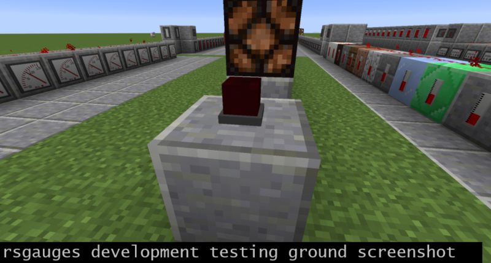

# Redstone Gauges and Switches (`rsgauges`)

`rsgaues` is a small [Minecraft](https://minecraft.net) (Java Edition) mod based on
[`Forge`](http://www.minecraftforge.net/). The Mod adds devices to measure or "produce"
redstone power to the game:

-  Gauges are small devices, which can be attached to any solid block in the game, and 
   they measure the redstone power that this blocks receives from blocks around it. 
   Their displays are analog or digital and quantised from 0 to 15. The measurement
   method differs a bit from how e.g. comparators or redstone lamps react, see the details 
   below.

-  Indicators are on-off displays attached to blocks, measuring like gauges (and are basically 
   gauges). They are "off" if the power is zero, and "on" if the power is greater than 
   zero. It depends on the indicator how the display looks like, some are simple LED like 
   lights, some are blinking, etc.

- Bistable switches are basically vanilla Minecraft levers with a different style. 
  They produce strong redstone power in the block they are attached to and are manually 
  switched on and off. There are currently no special features different from levers 
  implemented.

- Pulse switches are like vanilla Minecraft buttons with a different style. They also 
  produce strong redstone power in the block they are attached to, and they switch off 
  automatically after a short time. However, pulse switches can be pushed multiple times, 
  extending the delay (each right-click) before switching off again.

#### Summary screenshot

- Green framed: The currently implemented gauges, five analog and one digital display. 
  Topmost row: unpowered, row 2: powered by comparators behind the wall blocks (power 12 
  to 7).

- Blue framed: Indicators, bottom row: powered with redstone torches under the wall 
  blocks, row 3, unpowered. The alarm lamp (column 4) is always blinking when powered, the 
  small square lights have steady and blinking variants.

- Yellow framed: Pulse switches (well, "the" pulse switch).

- Orange framed: Bistable switches. Note that the ESTOP is inverted - it switches off when 
  pushed (it's an emergency stop button after all ;) ).

 

#### Testing ground screenshot

Development gamesave (flat world) invoked from the IDE. Each gauge and indicator
is installed with each power level, different kind of blocks are used to attach
the gauges to, etc. Should not differ much from the way others do it.

#### Testing gameplay screenshot

Testing game with 85 other mods installed, mainly to check compatibility and recipe
collisions (and it's also simply fun). The screenshot shows the front end of a (electrical) 
Diesel generator control. Walls and the red wiring is from [Blusunrize's Immersive Engineering](https://github.com/BluSunrize/ImmersiveEngineering/), 
the door from [Nihiltres Engineer's Doors](https://minecraft.curseforge.com/projects/engineers-doors/),
wall drawings from [Chisels and bits by AlgorithmX2](https://github.com/AlgorithmX2/Chisels-and-Bits),
gauges, the ESTOP button and the indicator above the door from this mod. The voltmeter
style gauges are used to show the state of charge of buffering capacitors (IE), the ESTOP
is to force the Diesel control off (actually an assembly language programmed [Minecoprocessor by ToroCraft](https://minecraft.curseforge.com/projects/minecoprocessors/)). The LED is used to show if the
Diesel generator is currently running or not.

## Recipes

- The first gauge is crafted 9x9 by putting redstone dust in the centre and bottom, filling 
  up the rest with iron nuggets. All other gauges are derived from this, simply put the first 
  gauge into the crafting area to get the second and so on. At the implemented last gauge it 
  rotates back to the first.

- The first indicator is crafted like the first gauge, except that glowstone dust is in the 
  centre. Then "rotate craft" the one that suits the style where you want to place it.
 

- The first bistable switch - surprise - has a lever in the centre, further style selections 
  same as above.

- The first pulse switch has a stone or wood button in the centre.

## Mod pack integration, forking, back ports, bug reports

- Packs: If your mod pack is open source as well and has no installer, you don't need to ask 
  and simply integrate this mod.

- Forking: It's MIT, you can fork the code under the same conditions.

- Back ports: I've just started modding and like to stick with MC versions >=1.12.2. Sorry, 
  no back ports.

- Bug reports: Yes, please let me know. Drop a mail or better open an issue for the repository.

## Revision history

- v1.0.0rc1 Initial feature complete version.

- v1.0.0rc2 Fix: Server based gauge processing to measure indirect weak power. 

- v1.0.0rc3 Fix: Tile entity based gauge handling to prevent display glitches on network clients. 

- v1.0.0rc4 Performance improvments, startup screen config options added.
            Fix: Network client: Gauge display zero when hit or activated. 

## Functional details

#### Gauges and indicators
Gauges measure a bit differently as e.g. redstone lamps. The gauges do not only react to the 
(strong or weak) power they receive themselves, but can also lookup the power that the adjacent 
block they face receives. This prevents the gauges from seeing indirect (weak) power from adjacent 
blocks, causing incorrect display values. The behaviour is:

  - If the gauge is attached to a block that can provide redstone power, such as a redstone 
    block or a device of a mod that has a redstone output on the side, then the gauge will 
    display the maximum of weak and strong power coming from the facing of that device. That 
    is pretty much as most redstone inputs behave.
    
  - If the gauge is attached to a block that cannot produce redstone power, but can be powered 
    (most blocks except glass, air, fluids, etc), then the gauge looks what power this block 
    received from all sides where blocks are that can provide redstone power. Also here the 
    maximum of weak and strong power is taken from each side, and then the maximum of all sides 
    is displayed. That means it behaves as if it would be the block behind it. This feature allows 
    you to place a gauge e.g. on a wall and feed the "signal" you want to measure to the back 
    side of the wall.
    
  - Gauges have fixed model and texture definitions (baked on startup by the Forge). Rendering is 
    mainly triggered by block updates, but backed up by a tile entity tick in case of packet 
    losses or other synchronisation issues.

  - Indicators are gauges in the source code (same class), with a different configuration during 
    construction. So gauges can generally determine powers from 0 to 15, emit light, and have 
    alternation (blinking) features.

#### Switches

Switches don't use tile entities, so they function pretty much like vanilla buttons and levers. 
Only difference is that the pulse switch re-schedules the block update with a higher delay when 
it is pressed again while being active. The delays are in ticks: 25 (first click when off), 50, 
100, 200, 400.

#### Style and textures

Although frequently using higher texture resolution than 16x16 and "sub pixel" model definitions 
I tried to stick to the rather-square-than-circle style that makes Minecraft so neat. Hope you 
don't mind.

## Community references

Mods covering similar features:

- [Automated Redstone (CD4017BE)](https://minecraft.curseforge.com/projects/automated-redstone) has redstone a display and an oscilloscope block.

- [More Beautiful Buttons (Kreezxil/Serj4ever57203)](https://minecraft.curseforge.com/projects/more-beautiful-buttons) support a variety of differently colored buttons.

- [MalisisSwitches (Ordinastie)](https://github.com/Ordinastie/MalisisSwitches) adds remote (wireless) switches to Minecraft.

- [Lever & Button Lights (Kreezxil)](https://github.com/kreezxil/Lever-Button-Lights) Buttons and levers that are also light sources.

- [Dazzle (quat1024)](https://github.com/quat1024/md18) has different lamp types (analog, modern, etc, different colours) also suitable for redstone power indication. 

- [Random Things (Lumien)](https://github.com/lumien231/Random-Things) has "contact levers" and "contact buttons", which you can hide behind the block you want to click to use as button or lever.

- [Project Red (MrTJP)](https://minecraft.curseforge.com/projects/project-red-base) also provides indicators and switches

- The [Immersive Engineering](https://github.com/BluSunrize/ImmersiveEngineering/) low voltage switch is a stylish redstone lever, too.

Making this mod was basically a weekend project for me to check what's new in Java. To learn how mods work 
took a look at the following codes and resources to get started, and like to give the authors credits accordingly: 
lothazar (cyclic), blusunrize (ie), vazkii (botania), the Forge smiths and documenters, thegrayghost (minecraft 
by example).
